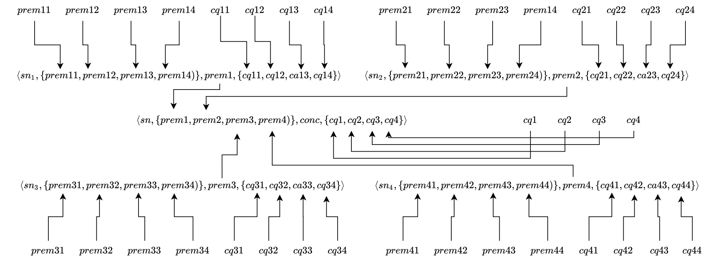
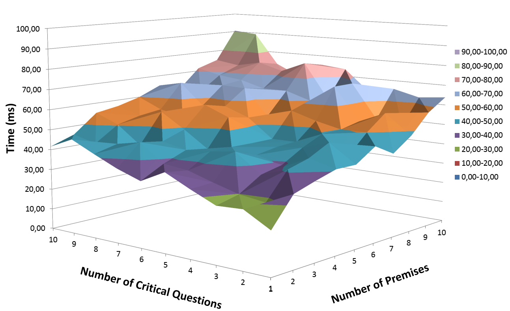
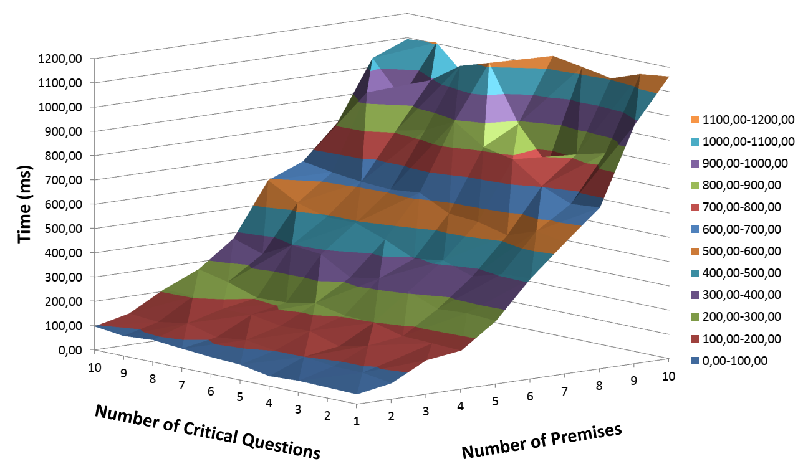

## Evaluation

We have implemented our approach extending the argumentation-based framework avaible [here](https://github.com/AlisonPanisson/ABRinAOPL) and reported in [1] and [2], which is implemented in the [Jason](http://jason.sourceforge.net/wp/) multi-agent platform. 

We have evaluated our implementation to verify how much time an agent needs to construct an acceptable instance of an argument from an argumentation scheme, depending on the number of premises and critical questions present in such scheme. In our experiments, we have considered both approaches for modelling argumentation schemes, i.e., with and without chained arguments.

The Figure below shows an abstract example for an inference tree generated by an agent reaching a conclusion `conc` using nested argumentation schemes (i.e., all `sn``i` argumentation schemes are nested to the argumentation scheme `sn`) with four premises and four critical questions. 

_________________________

_________________________

First, we evaluate our implementation when modelling argumentation schemes without chained arguments, in which premises and critical questions are asserted into agents' belief base. The Figure below shows our results, varying the number of premises and critical questions from `1` to `10`. It can be noted that there is a similar influence of the number of premises and critical questions in the final time for an agent to construct an acceptable instance of an argumentation scheme. 

_________________________

_________________________

We then evaluate our implementation considering chained arguments, in which the premises of the main argument are conclusions of other arguments constructed from different argumentation schemes. Thus, first an agent constructs acceptable instances of arguments from their respective argumentation schemes for each premise of the main argument, and using those premises it constructs the main argument as an acceptable instance of its respective argumentation scheme. The Figure below shows our results, varying the number of premises (and respective argumentation schemes, given each premise is the conclusion of an acceptable instance from a different argumentation scheme) and the critical questions. It can be noted that the number of premises has a greater influence on the time to construct the main argument than the number of critical questions. This results from the fact that premises of the main argument are conclusions of other arguments, which are constructed and evaluated from their respective argumentation schemes. For example, when considering nested argumentation schemes with 2 premises and 2 critical questions, besides answering the 2 critical questions of the main argumentation scheme, the premises of the main argument are the conclusion of 2 different arguments constructed from different argumentation schemes which also have 2 premises and 2 critical questions to be positively answered, that means means that they have their own critical questions to be positively answered. 

_________________________

_________________________

Our results provide a guide for the process of knowledge engineering of argumentation schemes in multi-agent systems (when using our implementation), showing how those reasoning patterns could be modelled depending on the multi-agent applications needs. On the one hand, when defining nested argumentation schemes, which will allow agents to execute a more detailed and refined reasoning process based on argumentation, as in~\cite{Panisson-2018-ASforDAC}, more time is required to agents to analyse and evaluate a particular conclusion from those argumentation schemes. On the other hand, when defining a single argumentation scheme, such reasoning is simplified but faster results are reached.

## References

[1] Panisson, Alison R., Felipe Meneguzzi, Renata Vieira, and Rafael H. Bordini. **An Approach for Argumentation-based Reasoning Using Defeasible Logic in Multi-Agent Programming Languages.** In *11th International Workshop on Argumentation in Multiagent Systems (ArgMAS)*. 2014.

[2] Panisson, Alison R., and Rafael H. Bordini. **Knowledge representation for argumentation in agent-oriented programming languages.** In *5th Brazilian Conference on Intelligent Systems (BRACIS)*, pp. 13-18. IEEE, 2016.

